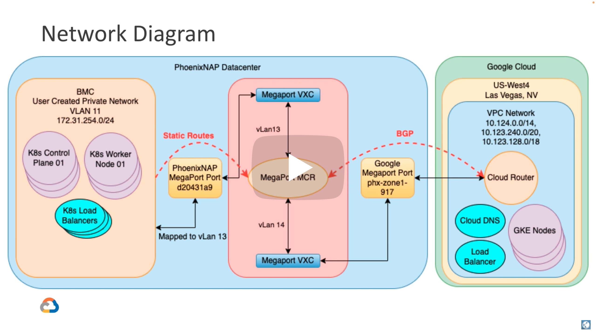

[](https://cloud.google.com/anthos) [](https://github.com/GCPartner/phoenixnap-megaport-anthos/blob/main/LICENSE) [](https://github.com/GCPartner/phoenixnap-megaport-anthos/pulls) 
# Google Anthos on PhoenixNAP with GKE on Google Cloud, interconnected by MegaPort
This [Terraform](http://terraform.io) module will allow you to deploy [Google Cloud's Anthos on Baremetal](https://cloud.google.com/anthos) on [PhoenixNAP](http://phoenixnap.com), a [GKE cluster](https://cloud.google.com/kubernetes-engine) on [Google Cloud](https://cloud.google.com), and interconnected by [MegaPort](http://megaport.com). This module then deploys a [MicroServices](https://github.com/GoogleCloudPlatform/microservices-demo) application spanning both Kubernetes clusters. With the web frontend and middlware being hosted in Google Cloud's GKE, and the backend database being hosted on an Anthos Cluster on  PhoenixNAP's Bare Metal Cloud. We then use [External DNS](https://github.com/kubernetes-sigs/external-dns) to create DNS records on the fly for our website, and [Cert Manager](https://cert-manager.io/) to get a valid SSL Certificate as well.
[](https://youtu.be/cgg8E9V9wpY?autoplay=1)
## Prerequisites 
### Software to Install
`Only Linux has been tested`
* [gcloud command line](https://cloud.google.com/sdk/docs/install)
* [terraform](https://www.terraform.io/downloads)
* [helm](https://helm.sh/docs/intro/install/)
* [kubectl](https://kubernetes.io/docs/tasks/tools/)
* [git](https://git-scm.com/book/en/v2/Getting-Started-Installing-Git)

### Accounts Needed
* [PhoenixNAP](https://phoenixnap.com/bare-metal-cloud)
* [Google Cloud Account](https://console.cloud.google.com/)
* [MegaPort Account](https://docs.megaport.com/setting-up/registering/)
### Other
* A domain name or subdomain you control DNS for
### Information to Gather
#### PhoenixNAP
* Client ID
* Client Secret
* Location
* Private Network Name
* Backend MegaPort Mapping vLan ID
#### Google Cloud
* Project ID
* Region
#### MegaPort
* Username
* Password
* [Interconnect Location Name](https://cloud.google.com/network-connectivity/docs/interconnect/concepts/choosing-colocation-facilities)
* Physical Port ID (In PhoenixNAP Datacenter)
#### Other
* E-Mail Address
* Domain Name(FQDN)

## Deployment
### Authenticate to Google Cloud
```bash
gcloud init # Follow any prompts
gcloud auth application-default login # Follown any prompts
```
### Clone the Repo
```bash
git clone https://github.com/GCPartner/phoenixnap-megaport-anthos.git
cd phoenixnap-megaport-anthos
```
### Create your *terraform.tfvars*
The following values will need to be modified by you.
```bash
cat <<EOF >terraform.tfvars 
cluster_name                  = "my-cluster"
domain_name                   = "my.domain.tld"
email_address                 = "my@email.tld"
pnap_client_id                = "******"
pnap_client_secret            = "******"
pnap_network_name             = "PNAP-Private-Network-Name" # Created ahead of time in PNAP
pnap_worker_node_count        = 1
pnap_ha_control_plane         = false
pnap_backend_megaport_vlan_id = 13 # Provided by PNAP
gcp_project_id                = "my-project" # Created ahead of time in GCP
gcp_region                    = "us-central1"
megaport_username             = "my@email.tld"
megaport_password             = "******"
megaport_physical_port_id     = "ee03c69b-319c-411d-abd9-03eb999bafda" # Provided by PNAP
EOF
```
### Initialize Terraform
```bash
terraform init
```
### Deploy the stack
```bash
terraform apply --auto-approve
```
### What success looks like
```
Apply complete! Resources: 78 added, 0 changed, 0 destroyed.

Outputs:

pnap_bastion_host_ip = "131.153.202.107"
pnap_bastion_host_username = "ubuntu"
ssh_command_for_pnap = "ssh -i /home/c0dyhi11/.ssh/anthos-pnap-lunch-xj62n ubuntu@131.153.202.107"
ssh_key_path = "/home/c0dyhi11/.ssh/anthos-pnap-lunch-xj62n"
website = "https://test1.codyhill.org"
```
<!-- BEGIN_TF_DOCS -->
## Requirements

| Name | Version |
|------|---------|
| <a name="requirement_kubectl"></a> [kubectl](#requirement\_kubectl) | ~>1.14.0 |

## Providers

| Name | Version |
|------|---------|
| <a name="provider_google"></a> [google](#provider\_google) | n/a |
| <a name="provider_google-beta"></a> [google-beta](#provider\_google-beta) | n/a |
| <a name="provider_kubernetes"></a> [kubernetes](#provider\_kubernetes) | n/a |
| <a name="provider_time"></a> [time](#provider\_time) | n/a |

## Modules

| Name | Source | Version |
|------|--------|---------|
| <a name="module_baremetal_anthos_cluster"></a> [baremetal\_anthos\_cluster](#module\_baremetal\_anthos\_cluster) | git@github.com:btjimerson/anthos-baremetal-terraform | n/a |
| <a name="module_cloud_services"></a> [cloud\_services](#module\_cloud\_services) | ./modules/cloud-services | n/a |
| <a name="module_gcp_networking"></a> [gcp\_networking](#module\_gcp\_networking) | ./modules/gcp-networking | n/a |
| <a name="module_gke_auth"></a> [gke\_auth](#module\_gke\_auth) | terraform-google-modules/kubernetes-engine/google//modules/auth | n/a |
| <a name="module_gke_cluster"></a> [gke\_cluster](#module\_gke\_cluster) | ./modules/gke-cluster | n/a |
| <a name="module_inlets_uplink"></a> [inlets\_uplink](#module\_inlets\_uplink) | ./modules/inlets-uplink | n/a |
| <a name="module_on_prem_services"></a> [on\_prem\_services](#module\_on\_prem\_services) | ./modules/on-prem-services | n/a |
| <a name="module_yba"></a> [yba](#module\_yba) | ./modules/yba | n/a |

## Resources

| Name | Type |
|------|------|
| [google-beta_google_gke_hub_feature_membership.feature_member](https://registry.terraform.io/providers/hashicorp/google-beta/latest/docs/resources/google_gke_hub_feature_membership) | resource |
| [google-beta_google_gke_hub_membership.membership](https://registry.terraform.io/providers/hashicorp/google-beta/latest/docs/resources/google_gke_hub_membership) | resource |
| [kubernetes_secret.git_creds](https://registry.terraform.io/providers/hashicorp/kubernetes/latest/docs/resources/secret) | resource |
| [time_sleep.wait_for_namespace](https://registry.terraform.io/providers/hashicorp/time/latest/docs/resources/sleep) | resource |
| [google_client_config.default](https://registry.terraform.io/providers/hashicorp/google/latest/docs/data-sources/client_config) | data source |

## Inputs

| Name | Description | Type | Default | Required |
|------|-------------|------|---------|:--------:|
| <a name="input_acm_config_sync_source_format"></a> [acm\_config\_sync\_source\_format](#input\_acm\_config\_sync\_source\_format) | The config sync source format (one of hierarchical \| unstructured) | `string` | `"unstructured"` | no |
| <a name="input_acm_git_repo"></a> [acm\_git\_repo](#input\_acm\_git\_repo) | The git repo URL for Anthos config management | `string` | n/a | yes |
| <a name="input_acm_namespace"></a> [acm\_namespace](#input\_acm\_namespace) | The name of the ACM default namespace | `string` | `"config-management-system"` | no |
| <a name="input_acm_repo_authentication"></a> [acm\_repo\_authentication](#input\_acm\_repo\_authentication) | The secret type for the ACM repo | `string` | `"none"` | no |
| <a name="input_acm_repo_branch"></a> [acm\_repo\_branch](#input\_acm\_repo\_branch) | The repo branch to sync for ACM | `string` | `"main"` | no |
| <a name="input_acm_repo_pat"></a> [acm\_repo\_pat](#input\_acm\_repo\_pat) | The personal access token for authentication to Git (only required if authentication is token) | `string` | `""` | no |
| <a name="input_acm_repo_username"></a> [acm\_repo\_username](#input\_acm\_repo\_username) | The username to use for authentication to Git (only required if authentication is token) | `string` | `""` | no |
| <a name="input_cert_manager_version"></a> [cert\_manager\_version](#input\_cert\_manager\_version) | The version of cert manager to install | `string` | `"v1.8.0"` | no |
| <a name="input_cloud"></a> [cloud](#input\_cloud) | The Cloud to deploy the Baremetal cluster on | `string` | `"PNAP"` | no |
| <a name="input_cluster_name"></a> [cluster\_name](#input\_cluster\_name) | The name(s) of the clusters to be deployed | `string` | `"my-cluster"` | no |
| <a name="input_domain_name"></a> [domain\_name](#input\_domain\_name) | The domain name to use for DNS records | `string` | n/a | yes |
| <a name="input_email_address"></a> [email\_address](#input\_email\_address) | The email address to use with Cert Manager | `string` | n/a | yes |
| <a name="input_gcp_project_id"></a> [gcp\_project\_id](#input\_gcp\_project\_id) | The GCP Project ID | `string` | n/a | yes |
| <a name="input_gcp_region"></a> [gcp\_region](#input\_gcp\_region) | The GCP Region | `string` | `"us-west4"` | no |
| <a name="input_gcp_router_asn"></a> [gcp\_router\_asn](#input\_gcp\_router\_asn) | The requested asn for Megaport | `number` | `16550` | no |
| <a name="input_gke_machine_type"></a> [gke\_machine\_type](#input\_gke\_machine\_type) | The machine type for GKE nodes | `string` | `"c2-standard-4"` | no |
| <a name="input_gke_node_count"></a> [gke\_node\_count](#input\_gke\_node\_count) | The number of worker nodes for the GKE cluster | `number` | `1` | no |
| <a name="input_gke_release_channel"></a> [gke\_release\_channel](#input\_gke\_release\_channel) | The release channel for GKE | `string` | `"RAPID"` | no |
| <a name="input_inlets_uplink_license"></a> [inlets\_uplink\_license](#input\_inlets\_uplink\_license) | The license key for uplink | `string` | n/a | yes |
| <a name="input_inlets_uplink_provider_domain"></a> [inlets\_uplink\_provider\_domain](#input\_inlets\_uplink\_provider\_domain) | The domain to use for the provider | `string` | n/a | yes |
| <a name="input_inlets_uplink_provider_email_address"></a> [inlets\_uplink\_provider\_email\_address](#input\_inlets\_uplink\_provider\_email\_address) | The email address to use for the provider | `string` | n/a | yes |
| <a name="input_inlets_uplink_provider_namespace"></a> [inlets\_uplink\_provider\_namespace](#input\_inlets\_uplink\_provider\_namespace) | The name of the namespace to install uplink provider | `string` | `"inlets"` | no |
| <a name="input_inlets_uplink_tunnels_namespace"></a> [inlets\_uplink\_tunnels\_namespace](#input\_inlets\_uplink\_tunnels\_namespace) | The name of the namespace to install uplink tunnels | `string` | `"tunnels"` | no |
| <a name="input_inlets_uplink_tunnels_predefined_token"></a> [inlets\_uplink\_tunnels\_predefined\_token](#input\_inlets\_uplink\_tunnels\_predefined\_token) | The pre-defined token for tunnels | `string` | n/a | yes |
| <a name="input_inlets_uplink_tunnels_predefined_token_name"></a> [inlets\_uplink\_tunnels\_predefined\_token\_name](#input\_inlets\_uplink\_tunnels\_predefined\_token\_name) | The name of the pre-defined token for tunnels | `string` | n/a | yes |
| <a name="input_pnap_client_id"></a> [pnap\_client\_id](#input\_pnap\_client\_id) | The client id for authentication to pnap | `string` | n/a | yes |
| <a name="input_pnap_client_secret"></a> [pnap\_client\_secret](#input\_pnap\_client\_secret) | The client secret for authentication to pnap | `string` | n/a | yes |
| <a name="input_pnap_cp_type"></a> [pnap\_cp\_type](#input\_pnap\_cp\_type) | The type of PNAP server to deploy for control plane nodes | `string` | `"s2.c1.medium"` | no |
| <a name="input_pnap_ha_control_plane"></a> [pnap\_ha\_control\_plane](#input\_pnap\_ha\_control\_plane) | Do you want a highly available control plane? | `bool` | `true` | no |
| <a name="input_pnap_location"></a> [pnap\_location](#input\_pnap\_location) | The pnap region to deploy nodes to | `string` | `"PHX"` | no |
| <a name="input_pnap_network_name"></a> [pnap\_network\_name](#input\_pnap\_network\_name) | The network\_id to use when creating server in PNAP | `string` | `""` | no |
| <a name="input_pnap_worker_node_count"></a> [pnap\_worker\_node\_count](#input\_pnap\_worker\_node\_count) | The number of worker nodes in PNAP | `number` | `1` | no |
| <a name="input_pnap_worker_type"></a> [pnap\_worker\_type](#input\_pnap\_worker\_type) | The type of PNAP server to deploy for worker nodes | `string` | `"s2.c1.medium"` | no |
| <a name="input_yba_admin_user_email"></a> [yba\_admin\_user\_email](#input\_yba\_admin\_user\_email) | The email address for the YBA admin user | `string` | n/a | yes |
| <a name="input_yba_admin_user_environment"></a> [yba\_admin\_user\_environment](#input\_yba\_admin\_user\_environment) | The environment for the YBA admin user | `string` | n/a | yes |
| <a name="input_yba_admin_user_full_name"></a> [yba\_admin\_user\_full\_name](#input\_yba\_admin\_user\_full\_name) | The full name for the YBA admin user | `string` | n/a | yes |
| <a name="input_yba_admin_user_kubernetes_name"></a> [yba\_admin\_user\_kubernetes\_name](#input\_yba\_admin\_user\_kubernetes\_name) | The Kubernetes name for the YBA admin user | `string` | n/a | yes |
| <a name="input_yba_admin_user_password"></a> [yba\_admin\_user\_password](#input\_yba\_admin\_user\_password) | The password for the YBA admin user | `string` | n/a | yes |
| <a name="input_yba_kubeconfig_config_map"></a> [yba\_kubeconfig\_config\_map](#input\_yba\_kubeconfig\_config\_map) | The config map name for YBA kubeconfig | `string` | `"yugabyte-kubeconfig-config"` | no |
| <a name="input_yba_namespace"></a> [yba\_namespace](#input\_yba\_namespace) | The name of the namespace for YBA | `string` | `"yugabyte"` | no |
| <a name="input_yba_operator_admin_crd_manifest"></a> [yba\_operator\_admin\_crd\_manifest](#input\_yba\_operator\_admin\_crd\_manifest) | The name of the admin user crd | `string` | `"adminusers-crd.yaml"` | no |
| <a name="input_yba_operator_cloud_provider_crd_manifest"></a> [yba\_operator\_cloud\_provider\_crd\_manifest](#input\_yba\_operator\_cloud\_provider\_crd\_manifest) | The name of the cloud provider crd | `string` | `"cloudproviders-crd.yaml"` | no |
| <a name="input_yba_operator_cluster_role_binding_manifest"></a> [yba\_operator\_cluster\_role\_binding\_manifest](#input\_yba\_operator\_cluster\_role\_binding\_manifest) | The name of the YBA operator cluster role binding | `string` | `"operator-cluster-role-binding.yaml"` | no |
| <a name="input_yba_operator_cluster_role_manifest"></a> [yba\_operator\_cluster\_role\_manifest](#input\_yba\_operator\_cluster\_role\_manifest) | The name of the YBA operator cluster role | `string` | `"operator-cluster-role.yaml"` | no |
| <a name="input_yba_operator_deployment_manifest"></a> [yba\_operator\_deployment\_manifest](#input\_yba\_operator\_deployment\_manifest) | The name of the YBA operator deployment | `string` | `"operator-deployment.yaml"` | no |
| <a name="input_yba_operator_github_repo"></a> [yba\_operator\_github\_repo](#input\_yba\_operator\_github\_repo) | The URL of the YBA operator Github repo | `string` | n/a | yes |
| <a name="input_yba_operator_namespace"></a> [yba\_operator\_namespace](#input\_yba\_operator\_namespace) | The namespace for the YBA operator and related objects | `string` | `"yba-operator"` | no |
| <a name="input_yba_operator_service_account_manifest"></a> [yba\_operator\_service\_account\_manifest](#input\_yba\_operator\_service\_account\_manifest) | The name of the YBA operator service account | `string` | `"operator-sa.yaml"` | no |
| <a name="input_yba_operator_universe_crd_manifest"></a> [yba\_operator\_universe\_crd\_manifest](#input\_yba\_operator\_universe\_crd\_manifest) | The name of the universe crd | `string` | `"universes-crd.yaml"` | no |
| <a name="input_yba_pull_secret"></a> [yba\_pull\_secret](#input\_yba\_pull\_secret) | The pull secret for YBA | `string` | n/a | yes |
| <a name="input_yba_role"></a> [yba\_role](#input\_yba\_role) | The name of the YBA role | `string` | `"yba-role"` | no |
| <a name="input_yba_role_binding"></a> [yba\_role\_binding](#input\_yba\_role\_binding) | The name of the YBA role binding | `string` | `"yba-role-binding"` | no |
| <a name="input_yba_sa"></a> [yba\_sa](#input\_yba\_sa) | The name of the YBA service account | `string` | `"yba-sa"` | no |
| <a name="input_yba_universe_management_cluster_role"></a> [yba\_universe\_management\_cluster\_role](#input\_yba\_universe\_management\_cluster\_role) | The name of the universe management cluster role | `string` | `"yugabyte-platform-global-admin"` | no |
| <a name="input_yba_universe_management_cluster_role_binding"></a> [yba\_universe\_management\_cluster\_role\_binding](#input\_yba\_universe\_management\_cluster\_role\_binding) | The name of the universe management cluster role binding | `string` | `"yugabyte-platform-global-admin"` | no |
| <a name="input_yba_universe_management_namespace"></a> [yba\_universe\_management\_namespace](#input\_yba\_universe\_management\_namespace) | The namespace for the universement management sa and role | `string` | `"kube-system"` | no |
| <a name="input_yba_universe_management_sa"></a> [yba\_universe\_management\_sa](#input\_yba\_universe\_management\_sa) | The name of the universe management service account | `string` | `"yugabyte-platform-universe-management"` | no |
| <a name="input_yba_version"></a> [yba\_version](#input\_yba\_version) | The version of YBA to install | `string` | n/a | yes |

## Outputs

| Name | Description |
|------|-------------|
| <a name="output_nginx_ingress_ip"></a> [nginx\_ingress\_ip](#output\_nginx\_ingress\_ip) | The IP address of the nginx ingress controler |
| <a name="output_pnap_bastion_host_ip"></a> [pnap\_bastion\_host\_ip](#output\_pnap\_bastion\_host\_ip) | IP Address of the bastion host in the test environment |
| <a name="output_pnap_bastion_host_username"></a> [pnap\_bastion\_host\_username](#output\_pnap\_bastion\_host\_username) | Username for the bastion host in the test environment |
| <a name="output_ssh_command_for_pnap"></a> [ssh\_command\_for\_pnap](#output\_ssh\_command\_for\_pnap) | Command to run to SSH into the bastion host |
| <a name="output_ssh_key_path"></a> [ssh\_key\_path](#output\_ssh\_key\_path) | Path to the SSH Private key for the bastion host |
| <a name="output_website"></a> [website](#output\_website) | The domain the website will be hosted on. |
| <a name="output_yba_ui_ip"></a> [yba\_ui\_ip](#output\_yba\_ui\_ip) | The IP address of the nginx ingress controller |
<!-- END_TF_DOCS -->
