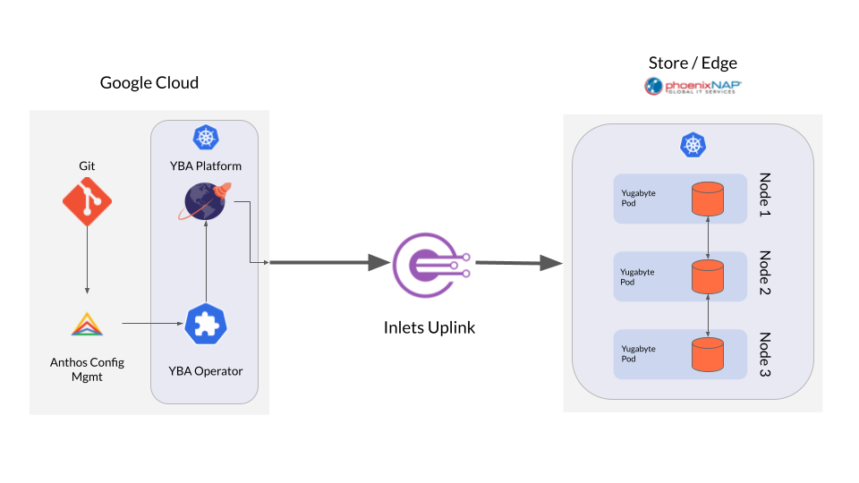

# Google Anthos on PhoenixNAP with GKE on Google Cloud, YugabyteDB Anywhere, with Istio multi-cluster between the clusters
This [Terraform](http://terraform.io) module will allow you to deploy [Google Cloud's Anthos on Baremetal](https://cloud.google.com/anthos) on [PhoenixNAP](http://phoenixnap.com), a [GKE cluster](https://cloud.google.com/kubernetes-engine) on [Google Cloud](https://cloud.google.com), and interconnected by [Istio](https://istio.io). This module then deploys [YugabyteDB Anywhere](https://www.yugabyte.com) on the GKE cluster, as well as an Anthos Configuration Management package to allow you to create a YugabyteDB Universe in the remote cluster.

## Prerequisites 
### Software to Install
* [gcloud command line](https://cloud.google.com/sdk/docs/install)
* [terraform](https://www.terraform.io/downloads)
* [helm](https://helm.sh/docs/intro/install/)
* [kubectl](https://kubernetes.io/docs/tasks/tools/)
* [git](https://git-scm.com/book/en/v2/Getting-Started-Installing-Git)
* [terrform-docs](https://terraform-docs.io/user-guide/installation/)
### Accounts Needed
* [PhoenixNAP](https://phoenixnap.com/bare-metal-cloud)
* [Google Cloud Account](https://console.cloud.google.com/)
### Information to Gather
#### PhoenixNAP
* Client ID
* Client Secret
* Location
* Private Network Name
#### Google Cloud
* Project ID
* Region

## Deployment
### Authenticate to Google Cloud
```bash
gcloud init # Follow any prompts
gcloud auth application-default login # Follown any prompts
```
### Clone the Repo
```bash
git clone https://github.com/btjimerson/yba-anthos-baremetal-terraform
cd yba-anthos-baremetal-terraform
```
### Create your Terraform variables file
The easiest way to set the required variables is to use `terraform-docs`
```bash
terraform-docs tfvars hcl .
```
Any variables that are blank will need to be set in a `*.auto.tfvars` or `terraform.tfvars` file. Optionally, you can override variables that have a default value.

Alternatively, you can use the [Inputs](#inputs) section below to create your variables file.
### Initialize Terraform
```bash
terraform init
```
### Apply the configuration
```bash
terraform apply 
```
### Outputs from the configuration
When you complete you should see an ouput like this:
```bash
Apply complete! Resources: 104 added, 0 changed, 0 destroyed.

Outputs:

remote_admin_token = "<redacted>"
remote_ingress_ip = "131.153.225.105"
remote_kubeconfig = <sensitive>
ssh_command_for_pnap = "ssh -o StrictHostKeyChecking=no -i /Users/bjimerson/.ssh/anthos-pnap-yba-abm-h48ak ubuntu@131.153.225.98"
yba_ui_ip = "34.27.56.44"
```
There are a few of the outputs that you'll need to finish setting up the environment:
#### `remote_admin_token`
Use this token to log into the remote Anthos Kubernetes cluster in the GKE console. You will need to do this to manage the remote cluster as part of the GKE fleet.

#### `remote_ingress_ip`
This is the IP address for the `IngressGateway` of the remote cluster. If you deploy an application to the remote cluster that needs to be available outside of the cluster, you can create an Istio `Gateway` for the application, and create a DNS record that points to this IP address. For an example of configuring a `Gateway` for your application, see this [file](https://github.com/btjimerson/ecommerce-demo/blob/main/deploy/frontend-gateway.yaml).

#### `remote_kubeconfig`
Use this value in the custom `CloudProvider` Kubernetes object's `spec.kubeconfig` value. This kubeconfig allows YBA in the GKE cluster to connect and provision resources in the remote cluster. Note that this value is considered a secret; in order to get the value you need to run a command like this:
```bash
terraform output remote_kubeconfig
```
Terraform outputs are always considered strings and are output surrounded with quotes for single-line values, and `<<EOT / EOT` for multiline values. Make sure you remove the `<<EOT/ EOT` from the output file before using it in the `CloudProvider` yaml.

#### `ssh_command_for_pnap`
This is the command to establish an SSH connection with the jumpbox host in PNAP, complete with the certificate. You will need to be on the jumpbox to execute any `kubectl` commands on the remote cluster.

#### `yba_ui_ip`
The is the `LoadBalancer` IP address for the YBA UI. Use it to access YBA.

<!-- BEGIN_TF_DOCS -->
## Requirements

| Name | Version |
|------|---------|
| <a name="requirement_kubectl"></a> [kubectl](#requirement\_kubectl) | ~>1.14.0 |

## Providers

| Name | Version |
|------|---------|
| <a name="provider_google"></a> [google](#provider\_google) | n/a |
| <a name="provider_null"></a> [null](#provider\_null) | n/a |

## Modules

| Name | Source | Version |
|------|--------|---------|
| <a name="module_baremetal_anthos_cluster"></a> [baremetal\_anthos\_cluster](#module\_baremetal\_anthos\_cluster) | github.com/btjimerson/anthos-baremetal-terraform | n/a |
| <a name="module_cloud_services"></a> [cloud\_services](#module\_cloud\_services) | ./modules/cloud-services | n/a |
| <a name="module_gcp_networking"></a> [gcp\_networking](#module\_gcp\_networking) | ./modules/gcp-networking | n/a |
| <a name="module_gke_auth"></a> [gke\_auth](#module\_gke\_auth) | terraform-google-modules/kubernetes-engine/google//modules/auth | n/a |
| <a name="module_gke_cluster"></a> [gke\_cluster](#module\_gke\_cluster) | ./modules/gke-cluster | n/a |
| <a name="module_istio_certs"></a> [istio\_certs](#module\_istio\_certs) | ./modules/istio-certs | n/a |
| <a name="module_on_prem_services"></a> [on\_prem\_services](#module\_on\_prem\_services) | ./modules/on-prem-services | n/a |

## Resources

| Name | Type |
|------|------|
| [null_resource.apply_cluster1_secret](https://registry.terraform.io/providers/hashicorp/null/latest/docs/resources/resource) | resource |
| [null_resource.apply_cluster2_secret](https://registry.terraform.io/providers/hashicorp/null/latest/docs/resources/resource) | resource |
| [google_client_config.default](https://registry.terraform.io/providers/hashicorp/google/latest/docs/data-sources/client_config) | data source |

## Inputs

| Name | Description | Type | Default | Required |
|------|-------------|------|---------|:--------:|
| <a name="input_cloud"></a> [cloud](#input\_cloud) | The Cloud to deploy the Baremetal cluster on | `string` | `"PNAP"` | no |
| <a name="input_cloud_acm_config_sync_source_format"></a> [cloud\_acm\_config\_sync\_source\_format](#input\_cloud\_acm\_config\_sync\_source\_format) | The config sync source format (one of hierarchical \| unstructured) | `string` | `"unstructured"` | no |
| <a name="input_cloud_acm_git_repo"></a> [cloud\_acm\_git\_repo](#input\_cloud\_acm\_git\_repo) | The git repo URL for ACM for GKE | `string` | n/a | yes |
| <a name="input_cloud_acm_namespace"></a> [cloud\_acm\_namespace](#input\_cloud\_acm\_namespace) | The name of the ACM for GKE default namespace | `string` | `"config-management-system"` | no |
| <a name="input_cloud_acm_repo_authentication"></a> [cloud\_acm\_repo\_authentication](#input\_cloud\_acm\_repo\_authentication) | The secret type for the ACM for GKE repo | `string` | `"none"` | no |
| <a name="input_cloud_acm_repo_branch"></a> [cloud\_acm\_repo\_branch](#input\_cloud\_acm\_repo\_branch) | The repo branch to sync for ACM for GKE | `string` | `"main"` | no |
| <a name="input_cloud_acm_repo_dir"></a> [cloud\_acm\_repo\_dir](#input\_cloud\_acm\_repo\_dir) | The directory in the repo containing configurations. Defaults to the root. | `string` | `""` | no |
| <a name="input_cloud_acm_repo_pat"></a> [cloud\_acm\_repo\_pat](#input\_cloud\_acm\_repo\_pat) | The personal access token for authentication to Git (only required if authentication is token) | `string` | `""` | no |
| <a name="input_cloud_acm_repo_username"></a> [cloud\_acm\_repo\_username](#input\_cloud\_acm\_repo\_username) | The username to use for authentication to Git (only required if authentication is token) | `string` | `""` | no |
| <a name="input_cluster_name"></a> [cluster\_name](#input\_cluster\_name) | The name(s) of the clusters to be deployed | `string` | `"my-cluster"` | no |
| <a name="input_gcp_project_id"></a> [gcp\_project\_id](#input\_gcp\_project\_id) | The GCP Project ID | `string` | n/a | yes |
| <a name="input_gcp_region"></a> [gcp\_region](#input\_gcp\_region) | The GCP Region | `string` | `"us-west4"` | no |
| <a name="input_gcp_router_asn"></a> [gcp\_router\_asn](#input\_gcp\_router\_asn) | The requested asn for Megaport | `number` | `16550` | no |
| <a name="input_gke_machine_type"></a> [gke\_machine\_type](#input\_gke\_machine\_type) | The machine type for GKE nodes | `string` | `"c2-standard-4"` | no |
| <a name="input_gke_node_count"></a> [gke\_node\_count](#input\_gke\_node\_count) | The number of worker nodes for the GKE cluster | `number` | `1` | no |
| <a name="input_gke_release_channel"></a> [gke\_release\_channel](#input\_gke\_release\_channel) | The release channel for GKE | `string` | `"RAPID"` | no |
| <a name="input_istio_cloud_prefix"></a> [istio\_cloud\_prefix](#input\_istio\_cloud\_prefix) | The prefix for Istio objects in GKE | `string` | `"cloud"` | no |
| <a name="input_istio_mesh_name"></a> [istio\_mesh\_name](#input\_istio\_mesh\_name) | The name of the Istio mesh | `string` | `"mesh1"` | no |
| <a name="input_istio_namespace"></a> [istio\_namespace](#input\_istio\_namespace) | The root namespace for Istio | `string` | `"istio-system"` | no |
| <a name="input_istio_on_prem_prefix"></a> [istio\_on\_prem\_prefix](#input\_istio\_on\_prem\_prefix) | The prefix for Istio objects in on-prem | `string` | n/a | yes |
| <a name="input_istio_version"></a> [istio\_version](#input\_istio\_version) | The version of Istio to install | `string` | n/a | yes |
| <a name="input_on_prem_acm_namespace"></a> [on\_prem\_acm\_namespace](#input\_on\_prem\_acm\_namespace) | The name of the ACM for on prem default namespace | `string` | `"config-management-system"` | no |
| <a name="input_on_prem_acm_repo_pat"></a> [on\_prem\_acm\_repo\_pat](#input\_on\_prem\_acm\_repo\_pat) | The personal access token for authentication to Git (only required if authentication is token) | `string` | `""` | no |
| <a name="input_on_prem_acm_repo_username"></a> [on\_prem\_acm\_repo\_username](#input\_on\_prem\_acm\_repo\_username) | The username to use for authentication to Git (only required if authentication is token) | `string` | `""` | no |
| <a name="input_pnap_client_id"></a> [pnap\_client\_id](#input\_pnap\_client\_id) | The client id for authentication to pnap | `string` | n/a | yes |
| <a name="input_pnap_client_secret"></a> [pnap\_client\_secret](#input\_pnap\_client\_secret) | The client secret for authentication to pnap | `string` | n/a | yes |
| <a name="input_pnap_cp_type"></a> [pnap\_cp\_type](#input\_pnap\_cp\_type) | The type of PNAP server to deploy for control plane nodes | `string` | `"s2.c1.medium"` | no |
| <a name="input_pnap_ha_control_plane"></a> [pnap\_ha\_control\_plane](#input\_pnap\_ha\_control\_plane) | Do you want a highly available control plane? | `bool` | `true` | no |
| <a name="input_pnap_location"></a> [pnap\_location](#input\_pnap\_location) | The pnap region to deploy nodes to | `string` | `"PHX"` | no |
| <a name="input_pnap_worker_node_count"></a> [pnap\_worker\_node\_count](#input\_pnap\_worker\_node\_count) | The number of worker nodes in PNAP | `number` | `1` | no |
| <a name="input_pnap_worker_type"></a> [pnap\_worker\_type](#input\_pnap\_worker\_type) | The type of PNAP server to deploy for worker nodes | `string` | `"s2.c1.medium"` | no |
| <a name="input_yba_kubeconfig_config_map"></a> [yba\_kubeconfig\_config\_map](#input\_yba\_kubeconfig\_config\_map) | The config map name for YBA kubeconfig | `string` | `"yugabyte-kubeconfig-config"` | no |
| <a name="input_yba_namespace"></a> [yba\_namespace](#input\_yba\_namespace) | The name of the namespace for YBA | `string` | `"yugabyte"` | no |
| <a name="input_yba_operator_admin_crd_manifest"></a> [yba\_operator\_admin\_crd\_manifest](#input\_yba\_operator\_admin\_crd\_manifest) | The name of the admin user crd | `string` | `"adminusers-crd.yaml"` | no |
| <a name="input_yba_operator_cloud_provider_crd_manifest"></a> [yba\_operator\_cloud\_provider\_crd\_manifest](#input\_yba\_operator\_cloud\_provider\_crd\_manifest) | The name of the cloud provider crd | `string` | `"cloudproviders-crd.yaml"` | no |
| <a name="input_yba_operator_cluster_role_binding_manifest"></a> [yba\_operator\_cluster\_role\_binding\_manifest](#input\_yba\_operator\_cluster\_role\_binding\_manifest) | The name of the YBA operator cluster role binding | `string` | `"operator-cluster-role-binding.yaml"` | no |
| <a name="input_yba_operator_cluster_role_manifest"></a> [yba\_operator\_cluster\_role\_manifest](#input\_yba\_operator\_cluster\_role\_manifest) | The name of the YBA operator cluster role | `string` | `"operator-cluster-role.yaml"` | no |
| <a name="input_yba_operator_deployment_manifest"></a> [yba\_operator\_deployment\_manifest](#input\_yba\_operator\_deployment\_manifest) | The name of the YBA operator deployment | `string` | `"operator-deployment.yaml"` | no |
| <a name="input_yba_operator_github_repo"></a> [yba\_operator\_github\_repo](#input\_yba\_operator\_github\_repo) | The URL of the YBA operator Github repo | `string` | n/a | yes |
| <a name="input_yba_operator_namespace"></a> [yba\_operator\_namespace](#input\_yba\_operator\_namespace) | The namespace for the YBA operator and related objects | `string` | `"yba-operator"` | no |
| <a name="input_yba_operator_service_account_manifest"></a> [yba\_operator\_service\_account\_manifest](#input\_yba\_operator\_service\_account\_manifest) | The name of the YBA operator service account | `string` | `"operator-sa.yaml"` | no |
| <a name="input_yba_operator_software_crd_manifest"></a> [yba\_operator\_software\_crd\_manifest](#input\_yba\_operator\_software\_crd\_manifest) | The name of the software crd | `string` | `"softwares-crd.yaml"` | no |
| <a name="input_yba_operator_universe_crd_manifest"></a> [yba\_operator\_universe\_crd\_manifest](#input\_yba\_operator\_universe\_crd\_manifest) | The name of the universe crd | `string` | `"universes-crd.yaml"` | no |
| <a name="input_yba_pull_secret"></a> [yba\_pull\_secret](#input\_yba\_pull\_secret) | The pull secret for YBA | `string` | n/a | yes |
| <a name="input_yba_role"></a> [yba\_role](#input\_yba\_role) | The name of the YBA role | `string` | `"yba-role"` | no |
| <a name="input_yba_role_binding"></a> [yba\_role\_binding](#input\_yba\_role\_binding) | The name of the YBA role binding | `string` | `"yba-role-binding"` | no |
| <a name="input_yba_sa"></a> [yba\_sa](#input\_yba\_sa) | The name of the YBA service account | `string` | `"yba-sa"` | no |
| <a name="input_yba_universe_management_cluster_role"></a> [yba\_universe\_management\_cluster\_role](#input\_yba\_universe\_management\_cluster\_role) | The name of the universe management cluster role | `string` | `"yugabyte-platform-global-admin"` | no |
| <a name="input_yba_universe_management_cluster_role_binding"></a> [yba\_universe\_management\_cluster\_role\_binding](#input\_yba\_universe\_management\_cluster\_role\_binding) | The name of the universe management cluster role binding | `string` | `"yugabyte-platform-global-admin"` | no |
| <a name="input_yba_universe_management_namespace"></a> [yba\_universe\_management\_namespace](#input\_yba\_universe\_management\_namespace) | The namespace for the universement management sa and role | `string` | `"kube-system"` | no |
| <a name="input_yba_universe_management_sa"></a> [yba\_universe\_management\_sa](#input\_yba\_universe\_management\_sa) | The name of the universe management service account | `string` | `"yugabyte-platform-universe-management"` | no |
| <a name="input_yba_version"></a> [yba\_version](#input\_yba\_version) | The version of YBA to install | `string` | n/a | yes |
| <a name="input_yugabyte_nodes_namespace"></a> [yugabyte\_nodes\_namespace](#input\_yugabyte\_nodes\_namespace) | The namespace where Yugabyte nodes will be deployed | `string` | `"yb-nodes"` | no |

## Outputs

| Name | Description |
|------|-------------|
| <a name="output_remote_admin_token"></a> [remote\_admin\_token](#output\_remote\_admin\_token) | The token for the remote admin service account |
| <a name="output_remote_ingress_ip"></a> [remote\_ingress\_ip](#output\_remote\_ingress\_ip) | The IP address of the ingress gateway for the remote cluster |
| <a name="output_remote_kubeconfig"></a> [remote\_kubeconfig](#output\_remote\_kubeconfig) | The kubeconfig for the remote Kubernetes cluster |
| <a name="output_ssh_command_for_pnap"></a> [ssh\_command\_for\_pnap](#output\_ssh\_command\_for\_pnap) | Command to run to SSH into the bastion host |
| <a name="output_yba_ui_ip"></a> [yba\_ui\_ip](#output\_yba\_ui\_ip) | The IP address of the YBA UI |
<!-- END_TF_DOCS -->
